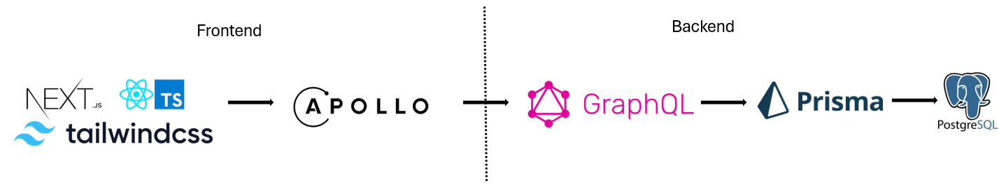
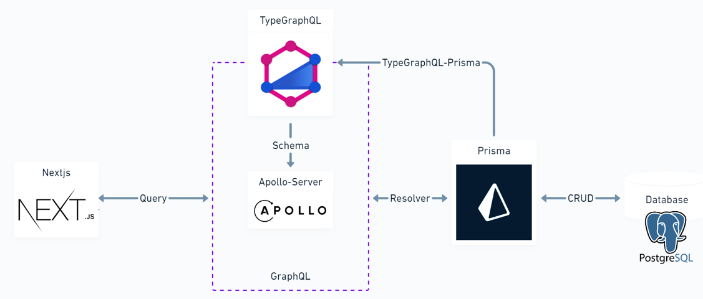
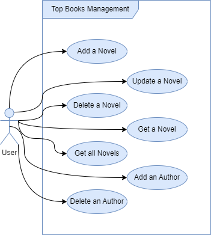
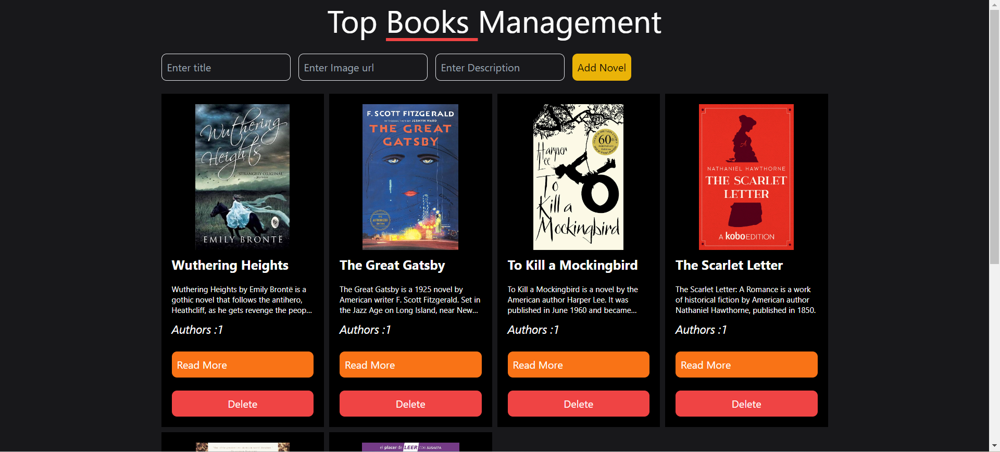
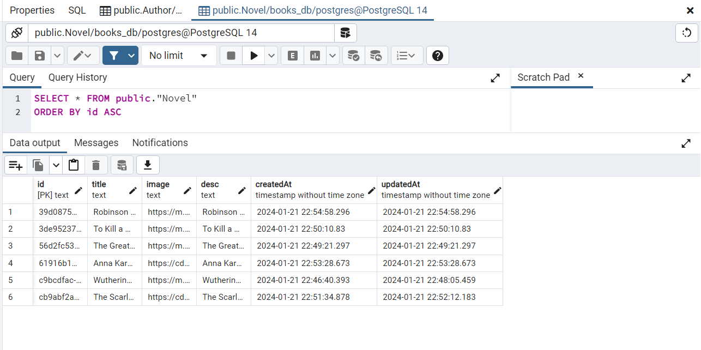

# Fullstack_App_GraphQL_NextJS_Postgres

Welcome to the Top Books Management App! This full-stack application is designed to manage the top books of all time. It is built using NextJS, GraphQL, Prisma, PostgreSQL, Apollo Server, Apollo Client, Prisma Studio, React with TypeScript, and styled with Tailwind CSS. The app supports CRUD operations and has two main entities: Author and Novel, with a one-to-many relationship between them.

## Table of Contents
- [Architecture](#architecture)
- [Features](#features)
- [Setup](#setup)
- [Usage](#usage)
- [GraphQL API](#graphql-api)
- [Screenshots](#screenshots)

## Architecture




The architecture diagrams above illustrates the main components of the application. It highlights the flow of data between NextJS, React, Typescript, TailwindCss, GraphQL, Prisma, PostgreSQL and Apollo Server.

## Features

- **Use Case Diagram:**

  

- **CRUD Operations:**
    - Add, Update, Delete Novel
    - Get a Novel by Novel ID
    - Get all Novels
    - Add, Delete Author

- **Data Model:**
    - Two tables: Author and Novel
    - One-to-many relationship between Author and Novel

## Setup

Follow these steps to set up and run the Top Books Management App:

1. **Clone the repository:**

   ```bash
   git clone https://github.com/DiluniAmarasekara/Fullstack_App_GraphQL_NextJS_Postgres.git
   cd fav-books-app

2. **Install dependencies:**
  
    ```bash
    npm install
    ```
    ```bash
    npm i prisma -D
    ```
    ```bash
    npm install @apollo/server graphql
    ```
    ```bash
    npm install @apollo/client graphql
    ```

3. **Set up your PostgreSQL database:**


   * Create a PostgreSQL database.
   * Update the connection string in the [.env](https://github.com/DiluniAmarasekara/Fullstack_App_GraphQL_NextJS_Postgres/blob/1c68b346867b223f03430afcbdfe5dd449d09176/fav-books-app/.env) file with your database details.

4. **Run the development server:**

    ```bash
    npm run dev
    ```

5. **Up the Prisma Studio**
    ```bash
    npx prisma studio 
    ```

## Usage
Visit http://localhost:3000 in your browser to access the Top Books Management App.

## GraphQL API
The GraphQL API is accessible at http://localhost:3000/api/graphql. You can use tools like GraphQL Playground to interact with the API.

**Example Queries/Mutations:**

* Get all Novels
```graphql
export const GET_NOVELS = gql`
	query Novels {
		novels {
			id
			image
			desc
			createdAt
			title
			updatedAt
			authors {
				id
				name
				novelId
			}
		}
	}
`;
```

* Add Novel
```graphql
export const ADD_NOVEL = gql`
  mutation AddNovel($image: String, $title: String, $desc: String) {
    addNovel(image: $image, title: $title, desc: $desc) {
      authors {
        id
        name
        novelId
      }
      createdAt
      id
      image
      title
      desc
      updatedAt
    }
  }
`;
```

* Delete Author
```graphql
export const DELETE_AUTHOR = gql`
	mutation Mutation($id: ID!) {
		deleteAuthor(id: $id) {
			id
			name
			novelId
		}
	}
`;
```

## Screenshots






